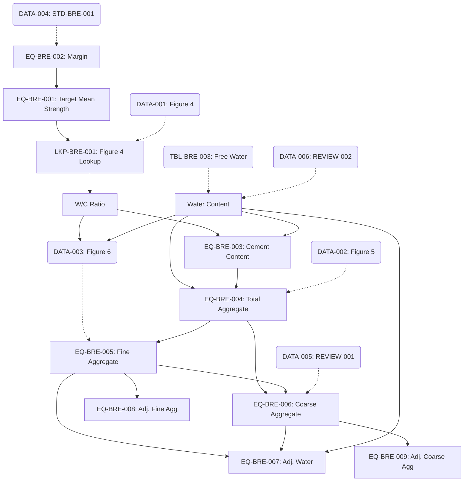

# Calculation Dependency Graph

> **Status:** STRUCTURALLY COMPLETE
> This graph shows the required sequence of calculations.

```mermaid
graph TD
    %% Stage 1
    EQ002[EQ-BRE-002: Margin] --> EQ001[EQ-BRE-001: Target Mean Strength]
    DATA004(DATA-004: STD-BRE-001) -.-> EQ002
    
    %% Stage 2
    EQ001 --> LKP001[LKP-BRE-001: Figure 4 Lookup]
    DATA001(DATA-001: Figure 4) -.-> LKP001
    LKP001 --> WCR[W/C Ratio]
    
    %% Stage 3
    TBL003(TBL-BRE-003: Free Water) -.-> W[Water Content]
    DATA006(DATA-006: REVIEW-002) -.-> W
    
    %% Stage 4
    WCR --> EQ003[EQ-BRE-003: Cement Content]
    W --> EQ003
    
    %% Stage 5
    W --> EQ004[EQ-BRE-004: Total Aggregate]
    EQ003 --> EQ004
    DATA002(DATA-002: Figure 5) -.-> EQ004
    
    %% Stage 6
    WCR --> DATA003(DATA-003: Figure 6)
    W --> DATA003
    DATA003 -.-> EQ005[EQ-BRE-005: Fine Aggregate]
    EQ004 --> EQ005
    
    %% Stage 7
    EQ004 --> EQ006[EQ-BRE-006: Coarse Aggregate]
    EQ005 --> EQ006
    DATA005(DATA-005: REVIEW-001) -.-> EQ006
    
    %% Stage 8 (Corrections)
    EQ005 --> EQ007[EQ-BRE-007: Adj. Water]
    EQ006 --> EQ007
    W --> EQ007
    
    EQ005 --> EQ008[EQ-BRE-008: Adj. Fine Agg]
    EQ006 --> EQ009[EQ-BRE-009: Adj. Coarse Agg]
```
